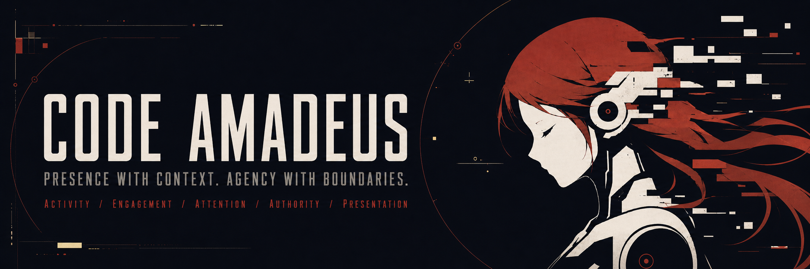

 

<a href="https://github.com/Code-Amadeus/Amadeus"><strong>Amadeus</strong></a>
&nbsp;&middot;&nbsp;
<a href="https://github.com/Code-Amadeus/Amadeus/blob/main/ARCHITECTURE.md">Architecture</a>
&nbsp;&middot;&nbsp;
<a href="https://github.com/Code-Amadeus/Amadeus/blob/main/ROADMAP.md">Roadmap</a>
&nbsp;&middot;&nbsp;
<a href="https://github.com/Code-Amadeus/Amadeus/blob/main/CONTRIBUTING.md">Contributing</a>

## Characters that do not merely appear — they participate

Code Amadeus is the public development home of **Amadeus**, a real-time
multimodal desktop agent evolving toward a persistent AI OS interface. It
connects conversation, optional voice and character presentation, delegated
work, durable artifacts, and cooperative applications while keeping identity,
permissions, execution authority, and recovery in the Host.

**Talk. Embody. Act. Stay in control.**

Code Amadeus 是 **Amadeus** 的公共开发组织。Amadeus 是一个实时多模态桌面
Agent，并逐步向持久化 AI OS 交互界面演进。它把对话、可选语音与角色表现、
委派执行、持久化产物和协作应用连接在一起，同时由 Host 持有身份、权限、
执行权与恢复事实。

**交流、具身、行动，同时让用户始终保持掌控。**

## Embodiment is more than appearance

Amadeus does not treat embodiment as animation added after an agent has acted.
A persistent character must inhabit ongoing activity, notice what matters,
participate appropriately, act only within explicit authority, and present the
accepted state as one coherent presence.

在 Amadeus 中，具身不是 Agent 完成工作后附加的一层动画。一个持续存在的角色
需要处于活动之中，关注与自己有关的事实，以合适的方式参与，只在明确权限内
行动，并用统一的角色表现呈现已经被系统接受的状态。

| Dimension / 维度 | The question / 核心问题 | In Amadeus / 系统落点 |
|---|---|---|
| **Activity** | What is happening over time? 正在持续发生什么？ | Conversation, playback, Work attempts, and application sessions. 对话、播放、工作尝试与应用会话。 |
| **Engagement** | How should the character participate? 角色应当如何参与？ | Converse, observe, wait, report, intervene, or recede as the activity changes. 随活动变化进行交流、观察、等待、汇报、介入或退居后台。 |
| **Attention** | What is relevant and visible to the character? 什么值得角色认知和关注？ | Host-scoped projections of progress, permission requests, artifacts, and application state. 由 Host 有界投射进度、权限请求、产物与应用状态。 |
| **Authority** | Who is allowed to claim or do this? 这个事实或动作由谁说了算？ | The Host owns identity, durable state, permissions, execution authority, and receipts; models interpret and narrate. Host 持有身份、持久状态、权限、执行权与回执；模型负责理解和叙述。 |
| **Presentation** | How should accepted reality be expressed now? 此刻应当如何表现已确认的现实？ | Voice, subtitles, lip sync, expression, motion, scene behavior, and visible work state. 语音、字幕、口型、表情、动作、场景行为与可见工作状态。 |

Many agent systems concentrate on activity and execution. Many character
systems concentrate on presentation. Amadeus connects all five without
allowing presentation to become authority.

许多 Agent 系统侧重活动与执行，许多桌面角色系统侧重表现。Amadeus 尝试连接
这五个维度，同时不让角色表现冒充系统事实。

## The ecosystem

| Project | Role | Current status |
|---|---|---|
| [**Amadeus**](https://github.com/Code-Amadeus/Amadeus) | Desktop companion runtime: Chat, Work, voice, character presentation, artifacts, Providers, and AUIP sessions. | Public **Source Alpha**; buildable source, not a packaged desktop release. |
| [**AUIP**](https://github.com/Code-Amadeus/AUIP) | Cooperative application-session and typed-action protocol. | Experimental v0 implemented in Amadeus; this protocol home documents status and links to the bundled SDK, examples, and tests. No independently versioned SDK or conformance suite release yet. |
| [**Amadeus SpriteForge**](https://github.com/Code-Amadeus/Amadeus-SpriteForge) | Local sprite asset review, saved behavior-graph editing, and KTX2 character-pack preview/export. | Public **Source Alpha** code, version 0.1.0, under AGPL-3.0-only. Generation services and the Amadeus runtime are separate. |
| [**Amadeus-SpriteForge-Animator**](https://github.com/Code-Amadeus/Amadeus-SpriteForge-Animator) | Planned character runtime SDK and standalone player: performance rules, mouth sync, parsed script cues, and texture/resource lifecycle. | **Placeholder / design draft**; purpose and migration plan published. No installable SDK, runnable player, or stable API yet. |
| [**Amadeus-Extensions**](https://github.com/Code-Amadeus/Amadeus-Extensions) | Design home for extending Amadeus with tools, workflows, applications, agents, and assets, with a focus on prompt budgets, routing, and lifecycle management. | **Exploratory**; public extension specifications, APIs, and SDKs have not yet been released. |

SpriteForge creates and exports character assets and behavior graphs. Animator is
planned to extract reusable performance rules, mouth presentation, rendering and
resource management from Amadeus, so authoring previews, standalone playback and
host applications can share one runtime. Hosts supply expression intent, audio
playback state and presentation ownership. See the [Animator draft plan](https://github.com/Code-Amadeus/Amadeus-SpriteForge-Animator/blob/main/PLAN.md).

SpriteForge 负责角色素材创作、行为图编辑与导出；Animator 计划把 Amadeus 中可复用的
导演规则、口型与闭口、解析后的脚本演出、渲染和资源管理独立出来，让创作预览、
独立播放器与宿主应用共享同一套运行时。宿主提供表达意图、音频播放状态与呈现权。
目前是占位与设计草案，详见 [Animator 计划](https://github.com/Code-Amadeus/Amadeus-SpriteForge-Animator/blob/main/PLAN.md#中文计划草案)。

## Current reality and direction

> [!IMPORTANT]
> **Direction is not delivery.** A persistent AI OS interface is the product
> direction. Amadeus currently provides open-source **Source Alpha** software
> under AGPL-3.0, without a packaged operating system or desktop installer.

- The current verified reference environment is Windows with CPython 3.12 and
  Node.js 22. A CPU/model-less path is the shortest supported first run;
  local voice and character packages are optional.
- Main Chat, Work Providers, and AUIP applications are separate authority
  domains. Sharing a registry or a screen does not silently share permissions.
- Models interpret meaning and narrate activity. The Host owns durable facts,
  identity, permissions, execution authority, and receipts.
- First-party Amadeus code is available under the
  [GNU Affero General Public License v3.0 (AGPL-3.0)](https://github.com/Code-Amadeus/Amadeus/blob/main/LICENSE).
  SpriteForge project code is [AGPL-3.0-only](https://github.com/Code-Amadeus/Amadeus-SpriteForge/blob/main/LICENSE).
  Third-party code, models, voices, characters, and external assets retain
  their own terms.

## Start here

- **Run or inspect the project:** [Amadeus README](https://github.com/Code-Amadeus/Amadeus#readme)
- **Understand the ownership boundaries:** [Architecture](https://github.com/Code-Amadeus/Amadeus/blob/main/ARCHITECTURE.md)
- **See active direction without treating it as a release promise:** [Roadmap](https://github.com/Code-Amadeus/Amadeus/blob/main/ROADMAP.md)
- **Contribute:** [Contributing guide](https://github.com/Code-Amadeus/Amadeus/blob/main/CONTRIBUTING.md)
- **Report a vulnerability:** [Security policy](https://github.com/Code-Amadeus/Amadeus/blob/main/SECURITY.md)

Presence with context. Agency with boundaries.

